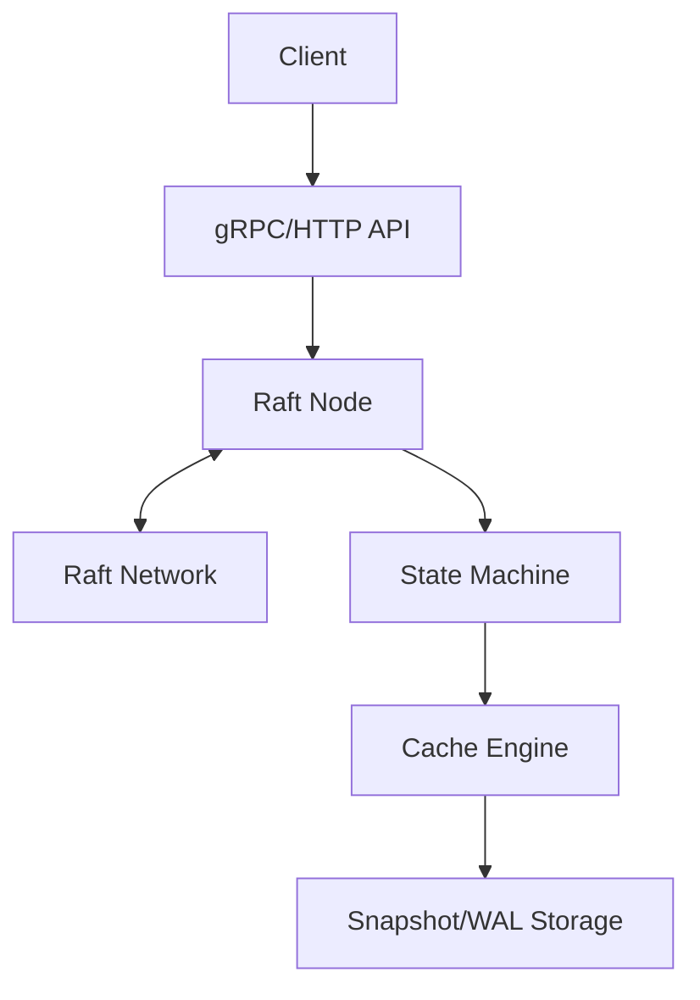
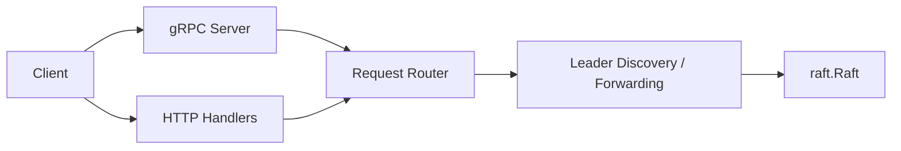
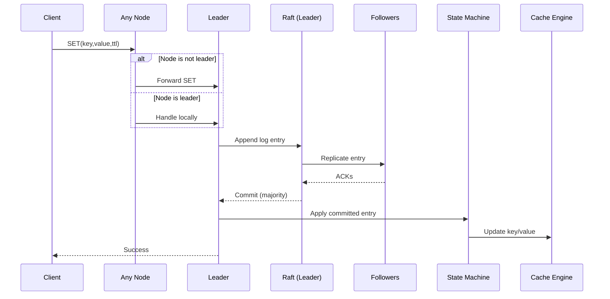
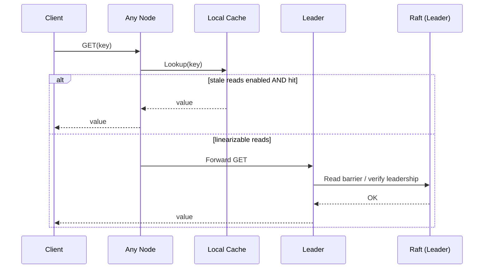
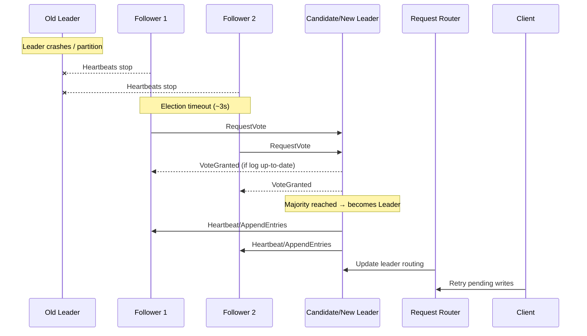
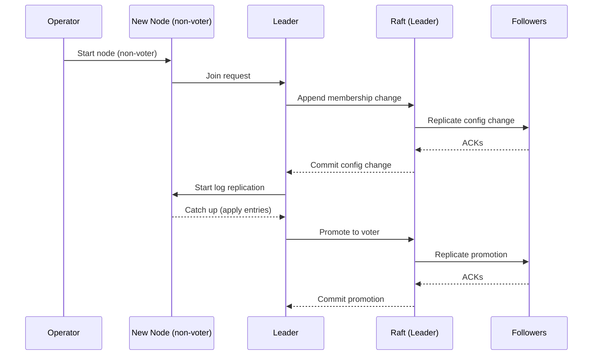
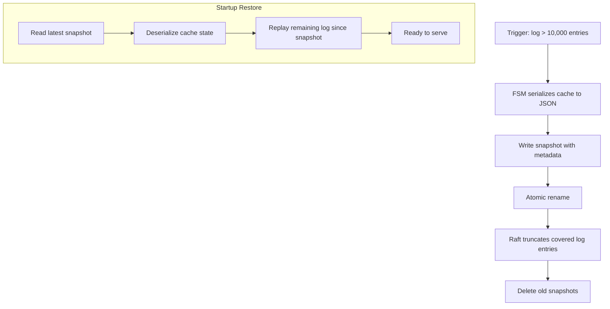
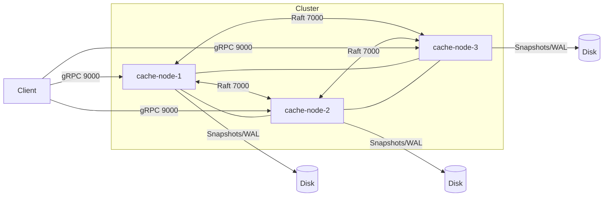

# Distributed Cache with Raft Consensus – Architecture Documentation


---

## 1. Introduction and Goals

### 1.1 Requirements Overview

**Contents**

This project implements a distributed, fault-tolerant cache system written in Go.  
It supports standard cache operations (SET, GET, DELETE, etc.), batch operations, and eviction policies.  
State is replicated across nodes using the Raft consensus algorithm via the HashiCorp Raft library.

The system exposes gRPC as its primary client interface, with an optional HTTP/REST API for debugging and compatibility.  
Persistence is achieved through write-ahead logging and periodic snapshots.

**Motivation**

The system demonstrates core distributed systems concepts—strong consistency, fault tolerance, leader-based replication—while remaining simpler than a full distributed database.

**Form**

Textual overview; detailed functional and non-functional requirements are defined in the project requirements specification (October 2025).

---

### 1.2 Quality Goals

| Priority | Quality Goal | Measurable Criteria |
|---------|--------------|---------------------|
| 1 | Strong Consistency | All writes linearizable; zero stale reads after commit |
| 2 | Fault Tolerance | System operational with 1 node failure in 3-node cluster; new leader elected in <5s |
| 3 | Performance | ≥10,000 ops/sec sustained; p50 read <5ms, p50 write <10ms, p99 <50ms |
| 4 | Observability | Prometheus metrics exported; structured logs with correlation IDs; 100% RPC tracing |
| 5 | Maintainability | <20% code duplication; test coverage ≥80%; clear module boundaries |

---

### 1.3 Stakeholders

| Role | Contact | Expectations |
|-----|--------|--------------|
| Developers | Marwan Abdalla, Patrick Weiss | Clear architecture, correctness, learning value |
| Instructor / Evaluator | Karl Michael Göschka | Demonstration of distributed systems concepts |
| Client Developers | — | Simple APIs, predictable behavior |
| Operators | — | Monitoring, stability, easy deployment |

---

## 2. Architecture Constraints

### 2.1 Technical Constraints
- Implementation language: Go
- Consensus protocol: Raft
- Raft implementation: HashiCorp Raft
- Client communication: gRPC (mandatory), HTTP/REST (optional)

### 2.2 Organizational Constraints
- Small team (2 developers)
- Limited academic timeline

### 2.3 Conventions
- Structured logging
- Architecture Decision Records (ADRs)

---

## 3. Context and Scope

### 3.1 Business Context

| Communication Partner | Inputs | Outputs |
|----------------------|--------|---------|
| Client Applications | Cache commands | Cached values, status codes |
| Operators | Monitoring queries | Metrics, health information |

The system acts as a black-box distributed cache providing strongly consistent key-value storage.

---

### 3.2 Technical Context

- Client communication via gRPC / HTTP
- Node-to-node communication via Raft RPCs
- Persistent storage on local filesystem

**Mapping**
- Cache operations → gRPC / HTTP
- Replication and membership → Raft protocol

---

## 4. Solution Strategy

### 4.1 Core Architectural Approaches

#### Consensus and Replication
- **Raft-based leader election**: HashiCorp Raft handles leader election, ensuring single write authority
- **Log replication**: All state changes flow through Raft log, guaranteeing total order
- **Transparent forwarding**: Non-leader nodes forward writes to current leader, simplifying client logic

#### State Management
- **State machine pattern**: In-memory cache acts as deterministic state machine applying committed log entries
- **Snapshot + WAL**: Periodic snapshots enable fast recovery; WAL ensures durability between snapshots
- **Eviction policies**: LRU and TTL mechanisms prevent unbounded memory growth

#### API Design
- **gRPC-first**: Binary protocol for performance; auto-generated clients
- **HTTP fallback**: REST API for debugging, monitoring, and tooling integration
- **Request routing layer**: Abstracts leader discovery and failover from clients

#### Quality Attribute Tactics

| Quality Goal | Architectural Tactic |
|--------------|---------------------|
| Strong Consistency | Synchronous replication to majority before commit |
| Fault Tolerance | No single point of failure; quorum-based decisions |
| Performance | In-memory storage; read-through leader for latest data |
| Observability | Prometheus metrics at every layer; structured logging |
| Maintainability | Clear module boundaries; HashiCorp Raft abstracts consensus complexity |

---

## 5. Building Block View

### 5.1 Whitebox Overall System

#### Overview (Mermaid)



#### Motivation
The system is decomposed to clearly separate concerns: API handling, consensus, state application, and persistence.

#### Contained Building Blocks

| Name | Responsibility |
|-----|---------------|
| API Layer | Exposes cache operations |
| Raft Node | Consensus and replication |
| State Machine | Applies committed log entries |
| Cache Engine | In-memory key-value store |
| Persistence Layer | WAL and snapshot management |

---

### 5.2 API Layer
- **Purpose**: Client interaction via gRPC/HTTP
- **Interfaces**: SET, GET, DELETE, MGET, etc.
- **Quality Characteristics**: Low latency, clear error handling

---

### 5.3 Raft Node
- **Purpose**: Maintain consistent replicated state
- **Interfaces**: HashiCorp Raft APIs
- **Quality Characteristics**: Strong consistency, fault tolerance

---

### 5.4 Cache Engine
- **Purpose**: Store key-value data in memory
- **Features**: TTL expiration, LRU eviction
- **Quality Characteristics**: High throughput, low latency

---

## 6. Level 2: Detailed Component View

### 6.1 White Box: API Layer

**Responsibilities:**
- Protocol handling (gRPC server, HTTP handlers)
- Request validation and deserialization
- Error code translation
- Metrics collection per endpoint

**Interfaces:**
- Inbound: Client connections (TCP/9000 for gRPC, TCP/8080 for HTTP)
- Outbound: Calls to Request Router

**Key Abstractions:**
- `CacheServiceServer` (gRPC interface)
- `HTTPHandler` (REST routes)

#### Component sketch (Mermaid)



---

### 6.2 White Box: Raft Node

**Responsibilities:**
- Leader election (timeout-based)
- Log replication to followers
- Commit index advancement
- Snapshot triggering and restoration
- Membership changes (add/remove nodes)

**Interfaces:**
- HashiCorp Raft API: `raft.Raft`
- FSM interface: `raft.FSM` (implemented by State Machine)
- Stable storage: `raft.StableStore`, `raft.LogStore`, `raft.SnapshotStore`

**Configuration:**
- Heartbeat timeout: 1s
- Election timeout: 3s
- Snapshot threshold: 10,000 log entries

---

### 6.3 White Box: State Machine (FSM)

**Responsibilities:**
- Apply committed log entries to Cache Engine
- Serialize cache state for snapshots
- Restore cache from snapshots

**Interfaces:**
- Implements `raft.FSM`: `Apply()`, `Snapshot()`, `Restore()`

**Key Properties:**
- Deterministic: same log produces same state
- Idempotent: replayed entries have no side effects

---

### 6.4 White Box: Cache Engine

**Responsibilities:**
- In-memory key-value storage (Go `map` + synchronization)
- LRU eviction (doubly-linked list + hashmap)
- TTL expiration (heap-based expiry queue)
- Atomic batch operations

**Interfaces:**
- `Set(key, value, ttl)`, `Get(key)`, `Delete(key)`, `Exists(key)`
- `MGet(keys)`, `MSet(entries)`, `MDel(keys)`

**Concurrency:**
- RWMutex for read scalability
- Lock-free reads for GET operations where possible

---

### 6.5 White Box: Persistence Layer

**Responsibilities:**
- Write-ahead log storage (Raft log entries)
- Snapshot file management (GZIP-compressed state dumps)
- Log compaction coordination

**Technology:**
- BoltDB for stable storage (key-value store)
- Filesystem for snapshot files

**Format:**
- Snapshots: JSON-encoded cache state with metadata (version, timestamp, node ID)

---

## 7. Runtime View

### 7.1 Runtime Scenario: Write Operation (SET)

1. Client issues SET request.
2. Request router forwards request to leader if necessary.
3. Leader appends command to Raft log.
4. Entry is replicated to followers.
5. After majority agreement, entry is committed.
6. State machine applies the change.
7. Cache is updated and response returned.

**Notable Aspects**
- Ensures linearizable writes
- Demonstrates fault tolerance and replication

#### Sequence (Mermaid)



---

### 7.2 Runtime Scenario: Read Operation (GET)

**Precondition**: Cluster operational, key exists in cache

1. Client sends GET request to any node
2. Node checks if key exists in local cache
3. If configured for stale reads: return local value immediately
4. If configured for linearizable reads:
   - Forward to leader
   - Leader performs read barrier (confirms it's still leader)
   - Return value
5. Record metrics (cache hit/miss, latency)
6. Return result to client

**Performance**: <5ms p50 latency for stale reads, <10ms for linearizable

#### Sequence (Mermaid)



---

### 7.3 Runtime Scenario: Leader Failure and Re-election

**Trigger**: Leader node crashes or network partition

1. Followers stop receiving heartbeats from leader
2. After election timeout (3s), candidate increments term and requests votes
3. Candidates send RequestVote RPCs to all peers
4. Nodes grant votes based on log completeness (up-to-date check)
5. Candidate receiving majority votes becomes new leader
6. New leader sends heartbeats, establishing authority
7. Request Router detects new leader, updates routing table
8. Clients' pending writes are retried against new leader

**Recovery Time**: <5 seconds (target: NFR-2.3)

#### Sequence (Mermaid)



---

### 7.4 Runtime Scenario: Node Addition

**Operator Action**: Add new node to existing cluster

1. Operator starts new node in "non-voter" mode
2. New node connects to leader, requests to join
3. Leader appends cluster membership change to log
4. Change is replicated and committed via Raft
5. Leader begins log replication to new node
6. New node catches up by applying log entries
7. Once caught up, leader promotes node to "voter"
8. New node participates in quorum decisions

**Key Challenge**: Minimize impact on cluster performance during catch-up

#### Sequence (Mermaid)



---

### 7.5 Runtime Scenario: Snapshot Creation and Restoration

**Trigger**: Log exceeds 10,000 entries

**Snapshot Creation:**
1. State Machine serializes cache to JSON
2. Snapshot includes metadata (term, index, configuration)
3. File written to disk with atomic rename
4. Raft truncates log entries covered by snapshot
5. Old snapshot files deleted

**Restoration (on startup):**
1. Node reads latest snapshot from disk
2. Deserializes cache state
3. Applies remaining log entries since snapshot
4. Node ready to serve requests

**Benefit**: Fast startup (<10s for 1M keys vs. minutes replaying full log)

#### Flow (Mermaid)



---

## 8. Deployment View

### 8.1 Infrastructure Level 1

- Each node runs:
  - Go application
  - Raft instance
  - In-memory cache
- Nodes communicate via TCP
- Deployment via Docker containers

### 8.2 Quality and Performance Features
- Isolation per node
- Fast recovery using snapshots
- Horizontal scalability

### 8.3 Mapping of Building Blocks

| Infrastructure Element | Software Artifact |
|-----------------------|-------------------|
| Node | API, Raft Node, Cache Engine |
| Disk | WAL, Snapshots |
| Network | Raft RPC, gRPC |

### 8.4 Node Configuration

**Ports:**
- 9000: gRPC API
- 8080: HTTP API
- 7000: Raft peer communication

### 8.5 Docker Deployment

**docker-compose.yml excerpt:**
```yaml
services:
  cache-node-1:
    image: distributed-cache:latest
    environment:
      - NODE_ID=node-1
      - RAFT_BIND_ADDR=0.0.0.0:7000
      - PEERS=cache-node-2:7000,cache-node-3:7000
    ports:
      - "9001:9000"
      - "8001:8080"
    volumes:
      - ./data/node-1:/data
```

#### Deployment Diagram (Mermaid)



### 8.6 Production Considerations

**Backup Strategy:**
- Automated snapshot backups to S3/filesystem every hour
- Retain 7 days of snapshots

**Disaster Recovery:**
- Restore from latest snapshot + replay WAL
- RTO target: <5 minutes
- RPO target: 0 (no committed data loss)

---

## 9. Cross-cutting Concepts

### 9.1 Logging
- Structured logging
- Configurable log levels
- Correlation IDs per request

### 9.2 Observability
- Raft metrics (leader, term, commit index)

### 9.3 Security
- Optional encryption for snapshot files

### 9.4 Concurrency Management

**Strategy**: Coarse-grained locking with read optimization

- **Cache Engine**: RWMutex allows concurrent reads, exclusive writes
- **Raft Node**: Internally synchronized by HashiCorp Raft
- **Request Router**: Lock-free leader tracking (atomic pointer swap)

**Trade-off**: Simplicity over maximum parallelism (acceptable for academic project scope)

---

### 9.5 Error Handling Strategy

**Principles:**
- Explicit error returns (Go idiom)
- Context propagation for timeouts/cancellation

**Error Categories:**

| Category | Example | Client Action |
|---------|---------|---------------|
| Client Error (4xx) | Invalid key format | Fix request, don't retry |
| Server Error (5xx) | Raft replication timeout | Retry with backoff |
| Leader Change (503) | Request forwarded but leader changed | Retry immediately |
| Not Found (404) | Key doesn't exist | Application logic handles |

---

### 9.6 Configuration Management

**Configuration Sources** (precedence order):
1. Command-line flags (highest priority)
2. Environment variables
3. Configuration file (YAML)
4. Compiled-in defaults (lowest priority)

---

## 10. Testing Strategy

**Unit Tests:**
- Cache Engine logic (eviction, TTL)
- State Machine determinism
- API request validation

**Integration Tests:**
- Raft consensus scenarios (leader election, log replication)
- Snapshot creation/restoration
- Client failover

**Chaos Testing (if time permits):**
- Random node crashes
- Network partition injection
- Clock skew simulation

---

## 11. Architecture Decisions

### ADR-001: Adoption of HashiCorp Raft Library

**Status**: Accepted

**Decision**  
Use the HashiCorp Raft library as the consensus mechanism.

**Rationale**  
Provides a mature, production-grade Raft implementation that integrates well with Go.

**Consequences**
- Reduced development risk and complexity
- Dependency on an external library

---

### ADR-002: gRPC as Primary Client Protocol

**Status**: Accepted

**Decision**: Use gRPC for client-server communication, with HTTP/REST as optional secondary interface.

**Rationale**
- High performance (binary protocol, HTTP/2 multiplexing)
- Type-safe contracts via Protocol Buffers
- Code generation for multiple languages
- Built-in streaming support (future: watch keys)

**Consequences**
- Positive: Performance, type safety, ecosystem
- Negative: HTTP debugging requires tooling (grpcurl); steeper learning curve

---

### ADR-003: In-Memory Cache (No Disk-Backed Mode)

**Status**: Accepted

**Decision**: Store cache data entirely in memory; persistence only via Raft snapshots.

**Rationale**
- Aligns with cache semantics (speed over durability)
- Simplifies eviction logic
- Raft snapshots provide sufficient durability for committed state

**Consequences**
- Positive: Simplicity, performance
- Negative: Memory limits dataset size; cold start requires snapshot restore

---

### ADR-004: Leader Forwarding vs. Client Redirection

**Status**: Accepted

**Decision**: Non-leader nodes forward write requests to leader (proxy pattern).

**Rationale**
- Simpler client implementation (single connection)
- Centralized request routing logic
- Acceptable latency overhead (~1ms)

**Alternatives Considered**
- Client redirection: Requires smarter clients; adds discovery complexity

**Consequences**
- Positive: Client simplicity
- Negative: Extra network hop; non-leader nodes become SPOF for writes

---

## 12. Quality Requirements

### 12.1 Quality Requirements Overview

| Category | Description |
|--------|-------------|
| Performance | Low latency, high throughput |
| Reliability | Tolerates node failures |
| Consistency | Linearizable writes |
| Observability | Metrics and logs |
| Security | Encrypted communication |

---

### 12.2 Quality Scenarios

#### QS-1: Strong Write Consistency
- **Source**: Client
- **Stimulus**: SET operation
- **Response**: Value visible to all nodes after commit
- **Measure**: Linearizability guaranteed

#### QS-2: Leader Failure Recovery
- **Source**: System failure
- **Stimulus**: Leader crash
- **Response**: New leader elected
- **Measure**: < 5 seconds recovery time

---

## 13. Risks and Technical Debts

### 13.1 Risks

| Risk | Likelihood | Impact | Mitigation | Status |
|------|-----------|--------|------------|--------|
| Raft misconfiguration causing split-brain | Medium | Critical | Testing with network partitions; conservative timeouts | Open |
| Memory exhaustion under high load | High | High | Strict eviction policies; memory limits; monitoring | Planned |
| Snapshot corruption | Low | High | Checksums; validation on restore; backup strategy | Open |
| Performance below 10K ops/sec | Medium | Medium | Early profiling; benchmarking; optimization iteration | Open |
| HashiCorp Raft API changes | Low | Medium | Pin library version; monitor release notes | Mitigated |
| Log growth outpacing snapshot frequency | Medium | Medium | Tune snapshot threshold; monitor disk usage | Planned |

### 13.2 Technical Debt

| Debt Item | Impact | Payoff | Priority |
|-----------|--------|--------|----------|
| No client-side caching/connection pooling | Higher latency | Client library development | Low |
| Synchronous snapshot writes block cluster | Availability dip during snapshot | Async snapshot with copy-on-write | Medium |
| No metric aggregation across nodes | Incomplete observability | Centralized metrics collector | Low |
| Coarse-grained cache locking | Lower read concurrency | Fine-grained locking or lock-free structures | Medium |

---

## 14. Glossary

| Term | Definition |
|-----|------------|
| Raft | Consensus algorithm for replicated state machines ensuring strong consistency |
| Leader | The single node in a Raft cluster responsible for accepting and coordinating writes |
| Follower | Passive nodes that replicate log entries from the leader |
| Candidate | Node competing for leadership during election |
| Term | Logical clock in Raft; increments with each election |
| WAL (Write-Ahead Log) | Sequential record of all operations; enables durability and recovery |
| Snapshot | Point-in-time serialization of cache state; enables fast recovery and log compaction |
| Linearizability | Strong consistency guarantee where operations appear to execute atomically at a single point in time |
| FSM (Finite State Machine) | Interface for applying committed log entries to application state (cache) |
| Quorum | Majority of nodes (⌈n/2⌉ + 1) required for commit in Raft |
| Log Compaction | Process of removing obsolete log entries covered by snapshots |
| Heartbeat | Periodic message from leader to followers asserting authority |
| Request Router | Component that forwards client writes to the current leader |
| Cache Hit | Successful retrieval of a key from cache |
| Cache Miss | Key not found in cache (expired or never set) |
| TTL (Time-To-Live) | Duration after which a cache entry automatically expires |
| LRU (Least Recently Used) | Eviction policy that removes least recently accessed entries when memory limit reached |
| gRPC | High-performance RPC framework using Protocol Buffers and HTTP/2 |
| BoltDB | Embedded key-value database used for Raft's stable storage |